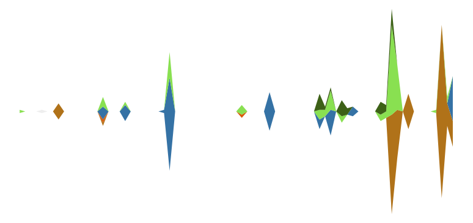

Language Usage Visualization
===

Visualize a user's commits as a stacked area graph per each language.



### Running

First install the required packages for the Python and Ruby components (as detailed in Gemfile and requirements.txt).

Then execute the script:

```shell
./visualize.sh username api_token
```

The script takes a while to execute since it needs to make a bunch of API
requests.
